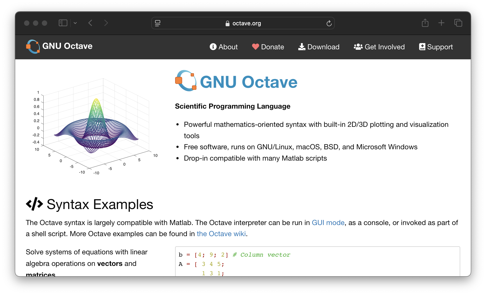
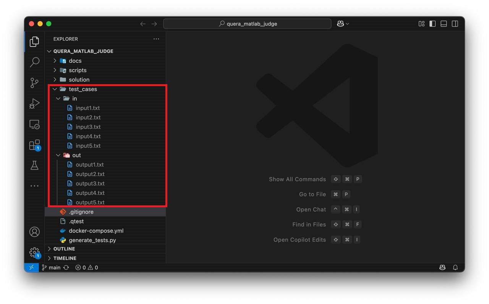
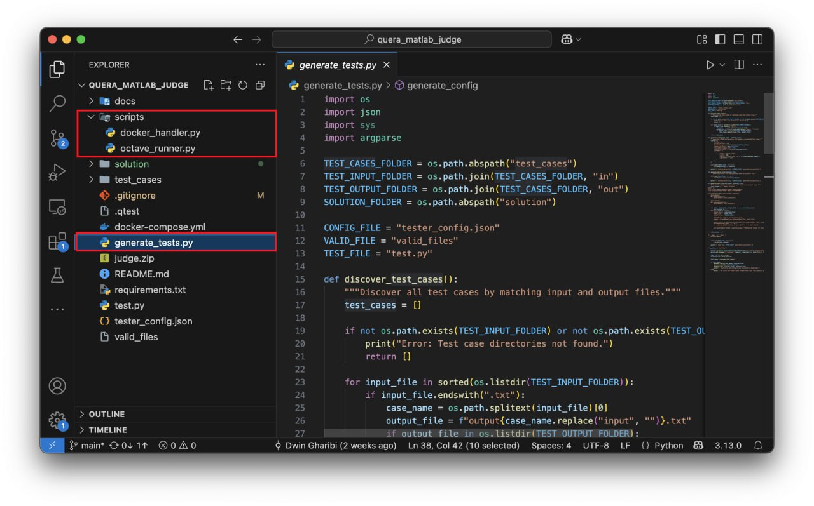
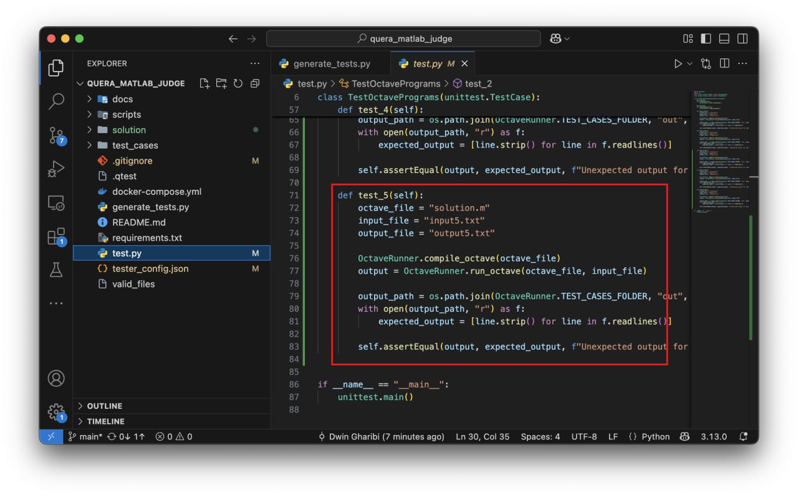
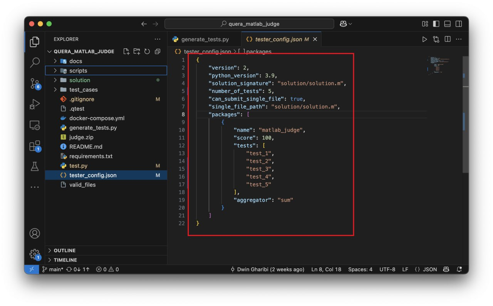
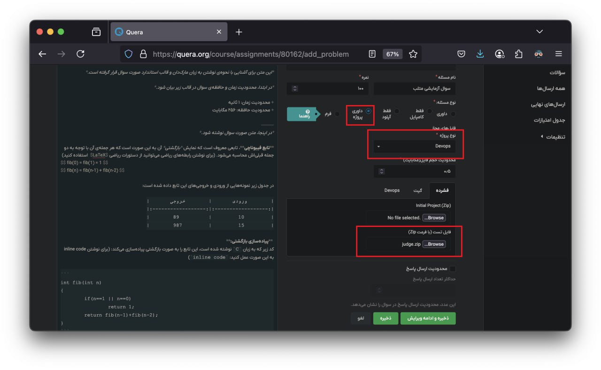
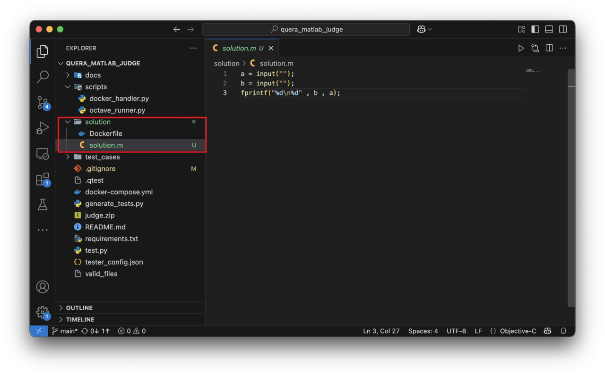

# Quera's MATLAB (Octave) Judge

Welcome to the **Quera's MATLAB (Octave) Judge** — a lightweight, containerized, and automated grading system for evaluating MATLAB-style `.m` code using @gnu-octave. It's designed for integration with [Quera's Paas Judge](https://github.com/QueraTeam), enabling hands-free code testing and evaluation, especially in educational and competition settings.


---

## 📌 Overview

This judge uses [GNU Octave](https://www.octave.org/) under the hood to execute and validate MATLAB-like code. Octave is a powerful open-source tool that closely mirrors MATLAB's syntax and capabilities, making it a great backend for judging MATLAB submissions without licensing restrictions.
- **Difference in Compatibility:** Around **10-20%** *(with MATLAB having some proprietary features not in Octave).*




The system is optimized for containerized environments using Docker, making deployment simple, portable, and scalable.

---

## 🔧 How it Works

The judging process includes:

1. **Putting** quera's input files in in and output files in out folder. **Pay attention to names!** It's **not** important to put them in **order,** because *test discoverer* will find all of them without problem, but there **should be a bijection** between input and output files, **if not they** will be **skipped** when using test discoverer!




2. **Run test dicoverer and generator.** You should run `generate_tests.py` file and give `--solution` flag and solution file name as an argument to it. It will discover tests you had put in test_cases folder before, generate code for test.py section which is main entry point, generate tester_config.json file which is judge configs and valid_files which is valid files that can be recived from users.










```python
python3 generate_tests.py --solution=solution.m
```

3. **Thats it!** Now just zip all the content and upload as a Quera's Paas (Devops) judge tester file! 



4. **Receiving some solution `.m` files** submitted by a user.




2. **Running the solution files using Octave Container** via a python judge script (`test.py`) that defines how the solution is tested.
3. **Comparing outputs** with expected results defined in test cases.

This system can be extended or adapted for a wide range of evaluation scenarios, including:
- Autograding in online courses
- Competitive programming contests
- In-browser coding challenges
- Interactive educational tools

---

## 🚀 Features

- ✅ **Automated judging** of MATLAB/Octave code
- 🧱 **Built on Quera’s Paas Judge**
- 🐳 **Containerized with Docker** for seamless deployment
- 🎓 **Open-source** and customizable
- 🧪 **Testcase discoverer** included
- 🧠 **Minimal dependencies** using standard Octave
- 🔧 **Easy integration** with learning platforms or backends


## ⚙️ Integration with Paas Judge

To integrate with [Quera's Paas Judge](https://github.com/QueraTeam/):

- Define a judge config that uses this container
- Format your problem input/output expectations accordingly
- Optionally, return structured JSON verdicts for easier parsing

---

🐳 docker-compose.yml

```
version: "3.3"
services:
  octave-container:
    image: registry.gitlab.com/qio/standard/gnuoctave/octave:8.2.0
    container_name: "octave-container"
    working_dir: /mnt
    volumes:
      - ./solution:/mnt
    stdin_open: true
    tty: true
    command: ["tail", "-f", "/dev/null"]
```

📌 What It Does

- Uses the official Octave image from GitLab.

- Mounts your local ./solution directory into the container's /mnt.

- Starts a persistent container (tail -f /dev/null) so you can run commands inside interactively.

- Useful for debugging or executing MATLAB/Octave .m files manually.

---


## 📁 Project Structure

```
quera_matlab_judge
├── README.md
├── assets
├── docker-compose.yml      # Octave docker-compose file 
├── generate_tests.py       # Tests generator and discoverer
├── requirements.txt
├── scripts                 # Octave Judge helpers (docker handler and octave runner)
│   ├── docker_handler.py
│   └── octave_runner.py
├── solution                # Solutions will come here (like solution.m)
│   ├── Dockerfile
│   └── solution.m
├── test.py                 # Main Tester, Entry point
├── test_cases              # Test cases for I/O judge
│   ├── in
│   │   └── ...
│   └── out
│       └── ...
├── tester_config.json      # Quera's tester config
└── valid_files             # Quera's tester valid files
```

---

## 🧠 MATLAB vs Octave: A Comparison

| Feature                | MATLAB                                 | GNU Octave                            |
|------------------------|-----------------------------------------|----------------------------------------|
| License               | Commercial (paid)                       | Free and open-source (GPL)             |
| Cost                  | Expensive for individuals/institutions | Free                                   |
| Compatibility         | Industry standard                       | High MATLAB compatibility              |
| Performance           | Faster, optimized toolboxes             | Slightly slower in computation-heavy ops |
| GUI                   | Rich, modern GUI                        | Basic GUI (optional)                   |
| Simulink Support      | Fully supported                         | Not supported                          |
| Toolboxes             | Proprietary, extensive                  | Limited open-source equivalents        |
| Community             | Large academic & corporate base         | Strong open-source contributors        |
| Integration           | Better IDE, integrations (Simulink, ML) | Script-based, CLI-focused              |

---

## 🧾 MATLAB vs Octave: Syntax Differences

Though Octave tries to match MATLAB syntax closely, there are **subtle differences** to be aware of when writing or judging code:

| Syntax / Behavior | MATLAB | Octave | Notes |
|-------------------|--------|--------|-------|
| Function definition | `function y = f(x)` | Same | Both support standard function syntax |
| Anonymous functions | `f = @(x) x^2;` | Same | Identical |
| End keyword | Optional for scripts/functions | Required in nested functions | Octave may require `endfunction` in some versions |
| Package import | `import pkg.*` | Not supported | Octave lacks MATLAB's OOP import mechanism |
| Error messages | Verbose and structured | Simpler output | Parsing errors may need customization |
| Plotting | `plot`, `subplot`, etc. | Similar but fewer features | Octave supports gnuplot and FLTK |
| GUI functions | `uicontrol`, `uipanel` | Not fully supported | Minimal UI toolkit in Octave |
| Java integration | `javaObject`, `javaaddpath` | Not supported | Octave lacks Java bridge |
| Object-Oriented | Full OOP: classes, methods | Partial support | Octave supports classdef but less complete |
| Toolboxes | Many toolboxes | Fewer, community-built | Some MATLAB toolboxes don’t exist in Octave |
