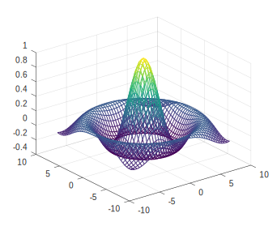
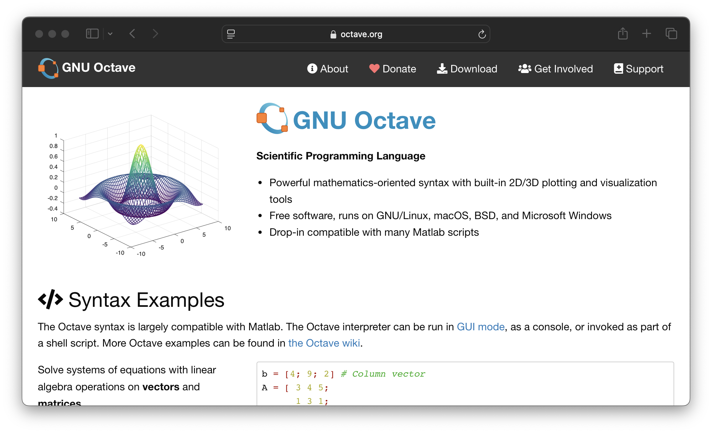

# Quera's MATLAB (Octave) Judge

Welcome to the **Quera's MATLAB (Octave) Judge** — a lightweight, containerized, and automated grading system for evaluating MATLAB-style `.m` code using **@gnu-octave**. It's designed for integration with [Quera's Paas Judge](https://github.com/QueraTeam), enabling hands-free code testing and evaluation, especially in educational and competition settings.

---

## 📌 Overview

This judge uses [GNU Octave](https://www.octave.org/) under the hood to execute and validate MATLAB-like code. Octave is a powerful open-source tool that closely mirrors MATLAB's syntax and capabilities, making it a great backend for judging MATLAB submissions without licensing restrictions.




The system is optimized for containerized environments using Docker, making deployment simple, portable, and scalable.

---

## 🔧 How it Works

The judging process includes:

1. **Receiving some solution `.m` files** submitted by a user.
2. **Running the solution files using Octave Container** via a python judge script (`test.py`) that defines how the solution is tested.
3. **Comparing outputs** with expected results defined in test cases.

This system can be extended or adapted for a wide range of evaluation scenarios, including:
- Autograding in online courses
- Competitive programming contests
- In-browser coding challenges
- Interactive educational tools

---

## 🚀 Features

- ✅ **Automated judging** of MATLAB/Octave code
- 🧱 **Built on Quera’s Paas Judge**
- 🐳 **Containerized with Docker** for seamless deployment
- 🎓 **Open-source** and customizable
- 🧪 **Testcase discoverer** included
- 🧠 **Minimal dependencies** using standard Octave
- 🔧 **Easy integration** with learning platforms or backends

---

## 📦 Setup

### 1. Clone the repository

```bash
git clone https://github.com/dwin-gharibi/quera_matlab_judge.git
cd quera_matlab_judge
```

---

## ⚙️ Integration with Paas Judge

To integrate with [Quera's Paas Judge](https://github.com/QueraTeam/):

- Define a judge config that uses this container
- Format your problem input/output expectations accordingly
- Optionally, return structured JSON verdicts for easier parsing

---

## 📁 Project Structure

```
quera_matlab_judge/
├── Dockerfile              # Octave-based judge environment
├── judge/
│   ├── judge.m             # Entry point for running tests
│   └── utils.m             # Helper scripts
├── sample_problems/
│   ├── solution.m          # Example correct solution
│   ├── input.txt           # Sample input
│   ├── expected_output.txt # Expected result
│   └── judge.m             # Custom judge logic
└── .github/
    └── workflows/
        └── test.yml        # GitHub Actions CI tests
```

---

## ✅ Continuous Integration with GitHub Actions

The repo includes a [GitHub Actions workflow](.github/workflows/test.yml) that builds the Docker image and runs tests against the sample problems to ensure the judge is functioning as expected.

---

## 🧠 MATLAB vs Octave: A Comparison

| Feature                | MATLAB                                 | GNU Octave                            |
|------------------------|-----------------------------------------|----------------------------------------|
| License               | Commercial (paid)                       | Free and open-source (GPL)             |
| Cost                  | Expensive for individuals/institutions | Free                                   |
| Compatibility         | Industry standard                       | High MATLAB compatibility              |
| Performance           | Faster, optimized toolboxes             | Slightly slower in computation-heavy ops |
| GUI                   | Rich, modern GUI                        | Basic GUI (optional)                   |
| Simulink Support      | Fully supported                         | Not supported                          |
| Toolboxes             | Proprietary, extensive                  | Limited open-source equivalents        |
| Community             | Large academic & corporate base         | Strong open-source contributors        |
| Integration           | Better IDE, integrations (Simulink, ML) | Script-based, CLI-focused              |

---

## 🧾 MATLAB vs Octave: Syntax Differences

Though Octave tries to match MATLAB syntax closely, there are **subtle differences** to be aware of when writing or judging code:

| Syntax / Behavior | MATLAB | Octave | Notes |
|-------------------|--------|--------|-------|
| Function definition | `function y = f(x)` | Same | Both support standard function syntax |
| Anonymous functions | `f = @(x) x^2;` | Same | Identical |
| End keyword | Optional for scripts/functions | Required in nested functions | Octave may require `endfunction` in some versions |
| Package import | `import pkg.*` | Not supported | Octave lacks MATLAB's OOP import mechanism |
| Error messages | Verbose and structured | Simpler output | Parsing errors may need customization |
| Plotting | `plot`, `subplot`, etc. | Similar but fewer features | Octave supports gnuplot and FLTK |
| GUI functions | `uicontrol`, `uipanel` | Not fully supported | Minimal UI toolkit in Octave |
| Java integration | `javaObject`, `javaaddpath` | Not supported | Octave lacks Java bridge |
| Object-Oriented | Full OOP: classes, methods | Partial support | Octave supports classdef but less complete |
| Toolboxes | Many toolboxes | Fewer, community-built | Some MATLAB toolboxes don’t exist in Octave |
